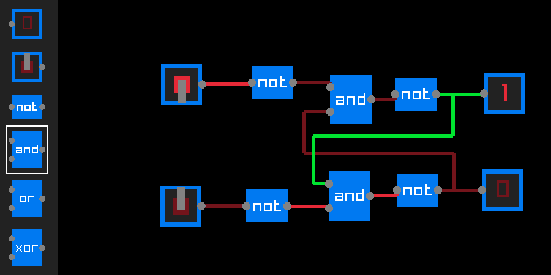

# kabel_vis 

kabel_vis is a simple circuit visualisation and simulation tool

<p align="center">
  
[flip-flop circuit](https://en.wikipedia.org/wiki/Flip-flop_(electronics))

dependencies
------------
 - [raylib](https://github.com/raysan5/raylib)
 - linux for hot reloading (static version might work on windows but I don't test it there)
 - a C compiler

todo
----
 - stop ignoring memory management and fix the leaks
 - add license

building and running
--------------------
Make sure to have raylib installed where the compiler will find it 
or add appropriate -I and -L flags to the build scripts.

## Static
```sh
./static-build.sh
./kabel_vis_static
```
## With hot reloading
```sh
./build.sh
./kabel_vis
```

controls
--------
## General
 - Right Mouse Button place/remove gates
 - Left Mouse Button drag scene or gates
 - Left Mouse Button toggle switch
 - Shift + scroll zoom
 - scroll / UpDown arrows select gate
 - scroll + Ctrl / LeftRight arrows select wire color
 - R hot reload (if available)
 - Ctrl + R close window hot reload then reopen window (if available)
## Connecting gates with wires
 Leftclick a gate port (gray circle) to start creating a wire.
 Leftclick anywhere to create a waypoint along the wire.
 Leftclick another connector to finish the connection
 or Rightclick/ESC to cancel.


 attempting to create a wire starting from an input (port on the left side of a gate)
 will remove the previous connection
 
 gate output ports may have arbitrarily many wires attached
